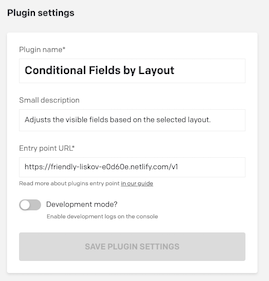
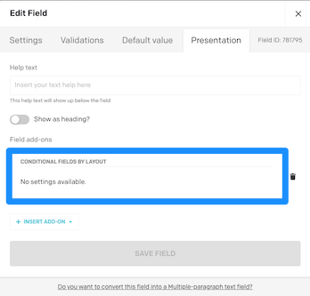
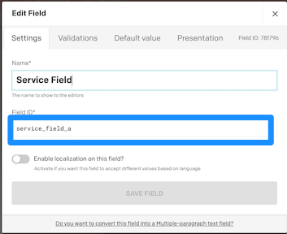

# Dato CMS Plugin Conditional Fields

Dato CMS Plugin to allow for conditional fields.

## V1 - Getting started

1. Add plugin to Dato CMS ([docs](https://www.datocms.com/docs/guides/building-plugins/creating-a-new-plugin)) use https://datocms-plugin-conditional-fields.netlify.com/v1 for the **Entry Point URL**

	
2. Enable the plugin on the required field(s) under the **Presentation** tab in the **Field add-ons** section

	
3. Add conditional fields by prefixing all related Field Ids to `{Lower Case Select Value}_field`. 
	- You can find the **Selelct Value** under the **Validations** tab of the field from step #2
	- Example: Select value `Service` prefix would be `service_field`. 
	- For multiple fields you can append anything after it. Example Field Ids: `service_field_one`, `service_field_two`, `service_field_three`

		
